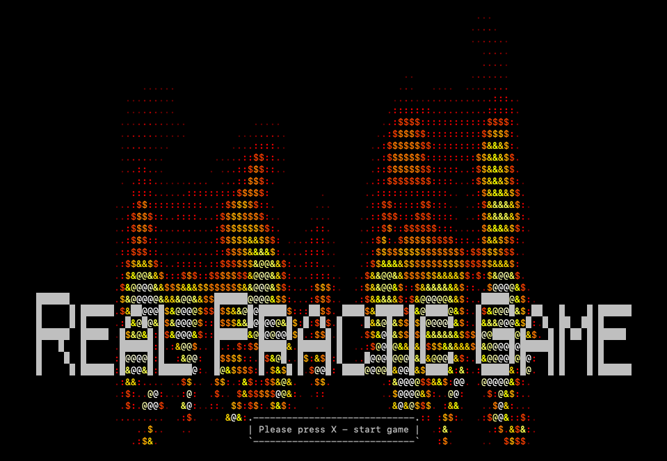

# Модуль создания персонажа для RPG игры

## Стек технологий и библиотек

- **Python** — основной язык программирования
- **asciimatics** — для создания интерактивных текстовых анимаций в терминале
- **pyfiglet** — для генерации ASCII-арт текста

## О проекте

**Базовый модуль создания персонажа** включает в себя:
* создание новой модели героя по заданному имени и выбранному классу персонажа (Warrior, Mage, Healer)
* прохождение тренировочного этапа с использованием базовых навыков (attack, defence) и специальных способностей (special) персонажа



## Внесенные в рамках проекта изменения

Рефакторинг файла `main.py` с применением принципов объектно-ориентированного программирования

## Запуск проекта

Клонировать репозиторий и перейти в него в командной строке:

```bash
git clone https://github.com/a-dagkes/character_creation_module.git
```

```bash
cd character_creation_module
```

Cоздать виртуальное окружение:

```bash
python3 -m venv env
```

Активировать виртуальное окружение:

* Если у вас Linux/macOS

    ```bash
    source env/bin/activate
    ```

* Если у вас windows

    ```bash
    source env/scripts/activate
    ```

💡 Все дальнейшие команды в терминале надо выполнять с активированным виртуальным окружением.

Обновить pip:

```bash
python -m pip install --upgrade pip
```

Установить зависимости из *requirements.txt*:

```bash
pip install -r requirements.txt
```

Запустить проект:

```bash
python main.py
```

##

## Credits
Original author: Andrew Gorlov

**Проект в рамках курса Python-разработчик в [ЯндексПрактикум](https://practicum.yandex.ru/).**
